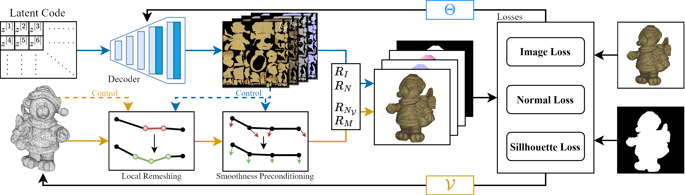

<h1 align="center" id="heading">ROSA: Reconstructing Object Shape and Appearance Textures by Adaptive Detail Transfer</h1>

<p align="center">
    <p align="center">
		<b><a href="https://cg.cs.uni-bonn.de/person/m-sc-julian-kaltheuner">Julian Kaltheuner</a><sup>1</sup></b>
        &nbsp;·&nbsp;
		<b><a href="https://cg.cs.uni-bonn.de/person/dr-patrick-stotko">Patrick Stotko</a><sup>1</sup></b>
        &nbsp;·&nbsp;
        <b><a href="https://cg.cs.uni-bonn.de/person/prof-dr-reinhard-klein">Reinhard Klein</a><sup>1</sup></b>
    </p>
    <p align="center">
        <sup>1</sup>University of Bonn &nbsp
    </p>
    <h3 align="center">WACV 2025</h3>
    <h3 align="center">
        <a href="https://arxiv.org/abs/2501.18595">Paper (arxiv)</a>
        &nbsp; | &nbsp;
        <a href="https://cg.cs.uni-bonn.de/publication/kaltheuner-2025-rosa">Project Page</a>
		</h3>
    <div align="center"></div>
</p>

<p align="center">
    
</p>

Code for reproducing the results will be released soon.

## Abstract

Reconstructing an object's shape and appearance in terms of a mesh textured by a spatially-varying bidirectional reflectance distribution function (SVBRDF) from a limited set of images captured under collocated light is an ill-posed problem. Previous state-of-the-art approaches either aim to reconstruct the appearance directly on the geometry or additionally use texture normals as part of the appearance features. However, this requires detailed but inefficiently large meshes, that would have to be simplified in a post-processing step, or suffers from well-known limitations of normal maps such as missing shadows or incorrect silhouettes. Another limiting factor is the fixed and typically low resolution of the texture estimation resulting in loss of important surface details. To overcome these problems, we present ROSA, an inverse rendering method that directly optimizes mesh geometry with spatially adaptive mesh resolution solely based on the image data. In particular, we refine the mesh and locally condition the surface smoothness based on the estimated normal texture and mesh curvature. In addition, we enable the reconstruction of fine appearance details in high-resolution textures through a pioneering tile-based method that operates on a single pre-trained decoder network but is not limited by the network output resolution.

## Citation

If you use the code for your own research, please cite our work as

```
@misc{kaltheuner2025rosareconstructingobjectshape,
      title={ROSA: Reconstructing Object Shape and Appearance Textures by Adaptive Detail Transfer}, 
      author={Julian Kaltheuner and Patrick Stotko and Reinhard Klein},
      year={2025},
      eprint={2501.18595},
      archivePrefix={arXiv},
      primaryClass={cs.CV},
      url={https://arxiv.org/abs/2501.18595}, 
}
```

## Acknowledgements

This research has been funded by the Federal Ministry of Education and Research under grant no. 01IS22094A WEST-AI, by the Federal Ministry of Education and Research of Germany as well as the state of North-Rhine Westphalia as part of the Lamarr-Institute for Machine Learning and Artificial Intelligence, INVIRTUO under grant no. PB22-063A and by the DFG project KL 1142/11-2.
